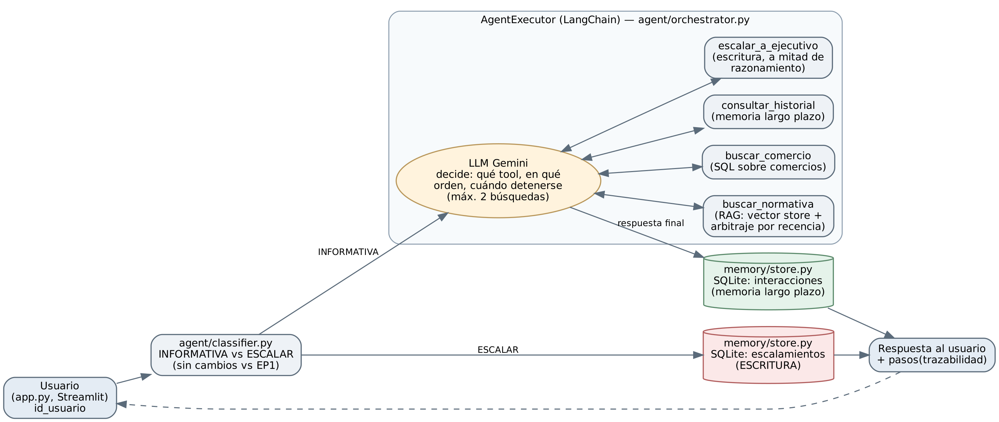

# Agente informativo BAES — Pluxee Chile

Agente basado en LLM y RAG que responde consultas normativas sobre el
beneficio BAES, y deriva a un ejecutivo humano las consultas transaccionales
o complejas.

## Requisitos
- Python 3.10+
- Una API key gratuita de Google AI Studio: https://aistudio.google.com/apikey

## Instalación
```bash
pip install -r requirements.txt
cp .env.example .env
# pega tu GOOGLE_API_KEY en .env
```

## Construir el índice (una sola vez)
```bash
python scripts/ingest_all.py
```
Esto también crea el archivo de memoria persistente (`data/processed/memoria.db`).

## Ejecutar
```bash
python -m streamlit run app.py --server.fileWatcherType none
```
Se abre automáticamente en el navegador, en `localhost:8501`. En la barra
lateral hay un campo "Tu identificador" — escribe el mismo valor en una
sesión nueva para que el agente pueda referenciar tus consultas anteriores
(memoria de largo plazo, ver `docs/arquitectura.md`).

## Verificar el agente (EP2)
Antes de confiar en que el AgentExecutor funciona, corre al menos un
escenario real (consume cuota de Gemini, ver limitaciones):
```bash
python scripts/check_agent_executor.py --escenario normativa
```
Ver el docstring del script para los otros 3 escenarios (`comercio`,
`escalamiento`, `memoria`).

**Nota:** se usa `python -m streamlit` en vez de `streamlit` directo porque en
algunos entornos (especialmente Windows) el ejecutable no queda en el PATH
del sistema pese a estar instalado. El flag `--server.fileWatcherType none`
evita que Streamlit escanee innecesariamente los submódulos de la librería
`transformers`, lo que sin el flag puede generar cientos de advertencias
inofensivas en la terminal y una carga inicial más lenta (pantalla en negro
por varios segundos antes de que aparezca la interfaz — no es un error).

## Estructura
- `agent/` — clasificador, generador (EP1), orquestador (EP2:
  `AgentExecutor`), tools del agente (EP2: `tools.py`), escalamiento (EP1,
  superado por `memory/store.py` en EP2, ver su docstring)
- `rag/` — carga de fuentes, chunking, embeddings, retrieval, arbitraje
- `memory/` — **EP2**: persistencia SQLite — escalamientos (escritura) y
  memoria de largo plazo (`interacciones`)
- `llm/` — wrapper del proveedor LLM (Gemini, nivel gratuito), usado por el
  clasificador
- `prompts/` — `clasificador.py` y `generador.py` (EP1), `agente.py` (EP2:
  system prompt del `AgentExecutor`)
- `data/` — fuentes (manual BAES real, FAQ, comercios simulados, social mock)
- `docs/arquitectura.md` — decisiones de diseño y limitaciones con evidencia,
  EP1 y EP2

## Arquitectura — diagrama de orquestación (EP2)



El clasificador (sin cambios respecto a EP1) decide INFORMATIVA vs ESCALAR. Si ESCALAR, se
registra la derivación directo en SQLite (escritura). Si INFORMATIVA, se arma un
`AgentExecutor` de LangChain con 4 tools (`buscar_normativa`, `buscar_comercio`,
`consultar_historial`, `escalar_a_ejecutivo`); el LLM decide qué tool invocar, en qué orden y
cuándo detenerse. Toda interacción resuelta se registra en la memoria de largo plazo antes de
responder. Detalle completo en `docs/arquitectura.md`.

## Limitaciones conocidas
- Nivel gratuito de Gemini: 5 solicitudes/min, 20/día — evitar ráfagas de
  preguntas seguidas. Si aparece un error `429 RESOURCE_EXHAUSTED`, es la
  cuota diaria agotada, no una falla del sistema; probar con una API key
  propia resuelve esto de inmediato.
- El umbral de arbitraje por similitud (0.9) prioriza evitar falsos positivos
  sobre detectar todas las contradicciones reales entre fuentes.
- El listado de comercios es un dataset simulado (Pluxee no publica uno
  descargable).
- El identificador de usuario de la memoria de largo plazo (barra lateral)
  no es autenticación real — cualquiera que lo escriba puede ver ese
  historial. Ver `docs/arquitectura.md`.
- El código de EP2 (`agent/tools.py`, `agent/orchestrator.py`) se escribió
  sin poder instalar `langchain`/`langchain-google-genai` en el entorno de
  desarrollo — **correr `scripts/check_agent_executor.py` antes de la
  presentación** para confirmar que compila y funciona con llamadas reales.
  `memory/store.py` sí se probó completo (ver `tests/test_memory_store.py`).

## Uso de IA
Se usó Claude para apoyo en redacción de código, diagramas y documentación
técnica. Decisiones de diseño e interpretación de resultados son propias.
